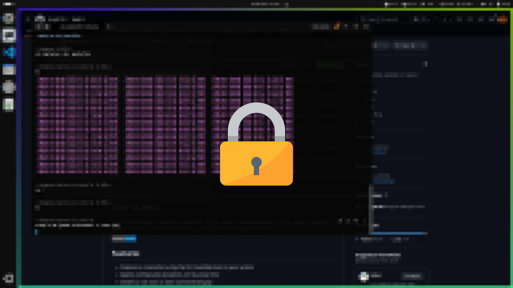

# lock-screen

A Linux lock screen that captures a screenshot of your desktop, applies pixelation and blur effects, optionally overlays a lock icon, and then locks the session. Works on both Wayland and X11.




## Features

- Captures a screenshot using the first available tool on your system
- Applies configurable pixelation and Gaussian blur
- Centers a lock icon on each connected display
- Supports multi-monitor setups (via `wlr-randr` or `xrandr`)
- Works on Wayland (swaylock) and X11 (i3lock / i3lock-color)

## Requirements

### Python

- Python **3.12** or newer
- [uv](https://docs.astral.sh/uv/) (recommended package/project manager)

### Screenshot tool (at least one)

The program tries each tool in order and uses the first one that succeeds:

| Priority | Tool                  | Desktop / Session        |
| -------- | --------------------- | ------------------------ |
| 1        | `cosmic-screenshot`   | COSMIC desktop           |
| 2        | `gnome-screenshot`    | GNOME (Wayland / X11)   |
| 3        | `spectacle`           | KDE Plasma               |
| 4        | XDG Desktop Portal    | Any Wayland (fallback)   |
| 5        | `scrot`               | X11                      |
| 6        | `import` (ImageMagick)| X11                      |

### Image processing

- **ImageMagick** (`convert`, `identify`) — used for blur, pixelation, and icon compositing.

```bash
# Debian / Ubuntu
sudo apt install imagemagick
```

### Lock backend (at least one)

| Session  | Lock utility                |
| -------- | --------------------------- |
| Wayland  | `swaylock`                  |
| X11      | `i3lock-color` or `i3lock`  |

```bash
# Wayland
sudo apt install swaylock

# X11
sudo apt install i3lock-color   # or: sudo apt install i3lock
```

### Display geometry (optional, for multi-monitor icon placement)

- `wlr-randr` (wlroots compositors) **or** `xrandr` (X11)

## Installation

### With uv (recommended)

```bash
git clone https://github.com/Greg0109/lock.git
cd lock
uv sync          # creates a venv and installs the project
```

The command `lock-screen` is now available inside the managed virtualenv.

### With pip

```bash
git clone https://github.com/Greg0109/lock.git
cd lock
pip install .
```

### System-wide (pipx)

```bash
pipx install git+https://github.com/Greg0109/lock.git
```

## Usage

```bash
# Using uv (from the project directory)
uv run lock-screen

# Or if installed globally / in an active venv
lock-screen
```

### Options

```
usage: lock-screen [-h] [--icon ICON] [--pixelate-scale N]
                   [--blur-radius R] [--blur-sigma S] [--no-icon]

Lock screen with blurred/pixelated screenshot background

options:
  -h, --help          show this help message and exit
  --icon ICON         Path to the lock icon image (default: lock.png in project root)
  --pixelate-scale N  Pixelation scale-down percentage (default: 10)
  --blur-radius R     Blur radius (default: 2)
  --blur-sigma S      Blur sigma (default: 5)
  --no-icon           Skip overlaying the lock icon
```

### Examples

```bash
# Default settings (pixelate + blur + lock icon)
lock-screen

# Heavier blur, no icon
lock-screen --blur-radius 4 --blur-sigma 10 --no-icon

# Custom icon with mild pixelation
lock-screen --icon ~/icons/padlock.png --pixelate-scale 20

# Less pixelation, more blur
lock-screen --pixelate-scale 30 --blur-radius 3 --blur-sigma 8
```

### Using the justfile

A [justfile](https://github.com/casey/just) is included for convenience:

```bash
just run                        # run with defaults
just run --no-icon              # pass extra arguments
just run-icon ~/icons/lock.png  # run with a custom icon
just lint                       # ruff check
just fmt                        # ruff format
just check                      # lint + format check
just fix                        # auto-fix lint + format
just build                      # build distributable package
just clean                      # remove build artefacts
```

## Binding to a keyboard shortcut

You can bind `lock-screen` to a key in your compositor or window manager config.

**Sway / i3** (`~/.config/sway/config` or `~/.config/i3/config`):

```
bindsym $mod+l exec lock-screen
```

**COSMIC** (Settings → Keyboard → Custom Shortcuts):

```
lock-screen
```

**Hyprland** (`~/.config/hypr/hyprland.conf`):

```
bind = $mainMod, L, exec, lock-screen
```

## Debugging

Set the `LOCK_SCREEN_DEBUG` environment variable to attach a `debugpy` session:

```bash
LOCK_SCREEN_DEBUG=true lock-screen
# Then attach VS Code or any DAP client to localhost:5678
```

## License

MIT
